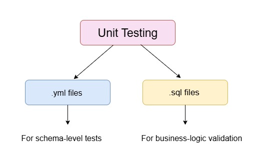

# ❤️ Find Love – Marketing Campaign Analytics (Anonymised Project)

This project is an **end-to-end marketing analytics pipeline** built for a dating company (anonymised as *Find Love*).  
It takes raw data from Facebook, TikTok, sign-ups, transactions, and currency exchange rates, then transforms it into a clean, ready-to-use dataset that powers a **self-serve dashboard** for the marketing team.  

---

## 🎯 Project Goal
To help the marketing team answer three simple questions:
1. Which campaigns are bringing in the most new customers?  
2. How much money are we spending to turn a sign-up into a paying customer?  
3. Which channels give the best return for every pound spent?  

---

## 📂 Data Sources
- **Facebook spend** – ad campaign costs (already in GBP).  
- **TikTok spend** – ad campaign costs (converted from USD to GBP).  
- **FX rates** – daily currency conversions.  
- **Sign-ups** – new user registrations with campaign attribution.  
- **Transactions** – customer payments in GBP and EUR.  

---

## ⚙️ Data Pipeline
  
*From raw CSVs → cleaning & validation → analytics table → Looker dashboard.*  

Steps:
1. **Load** raw datasets into BigQuery.  
2. **Clean** data: remove duplicates, fix currency issues, split campaign details.  
3. **Validate** with dbt tests: check for missing values, wrong formats, or negative spend.  
4. **Assemble** a single campaign performance table with key metrics.  
5. **Visualise** results in Looker so marketers can explore without writing SQL.  

---

## 📊 Dashboard Highlights

### Funnel View
  
*Shows how money spent flows into sign-ups, then into paying customers.*  

### Channel Comparison
  
*Side-by-side view of TikTok vs Facebook effectiveness.*  

### Spending Efficiency
  
*How much revenue each pound of ad spend generated, campaign by campaign.*  

### Dashboard Snapshots
  
  

---

## ✅ Data Quality
  
All cleaning and transformations are tested in **dbt**, ensuring:
- No missing or duplicate sign-ups.  
- No negative or invalid ad spend.  
- Currency conversions applied consistently.  

---

## 🔑 Key Insights
1. **TikTok outperformed Facebook** – lower cost per paying customer and higher revenue return.  
2. **Campaign D was the winner** – every pound spent returned £1.70 in revenue.  
3. **Campaign A lost money** – spend was equal to or greater than customer revenue, so it should be paused.  
4. **UK campaigns beat France** – higher returns per pound spent in Great Britain.  
5. **Organic sign-ups were high but didn’t generate revenue** – they need follow-up nudges to convert.  

---

## 🛠️ Tech Stack
- **BigQuery** – cloud data warehouse.  
- **dbt** – transformations + testing.  
- **Looker** – dashboard delivery.  
- **GitHub** – version control and code sharing.  

---

## 🚀 Future Improvements
- Automate daily runs with Airflow or dbt Cloud.  
- Add creative-level and audience-level data for deeper campaign insights.  
- Track post-sign-up “success events” (e.g. *started a relationship*) to measure true outcomes, not just purchases.  

---
